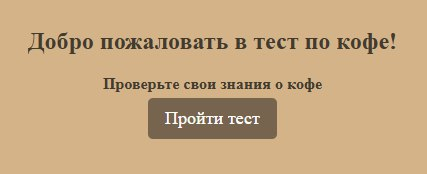
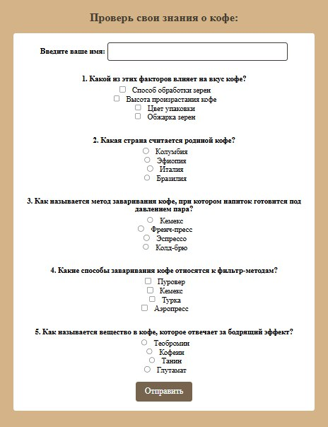
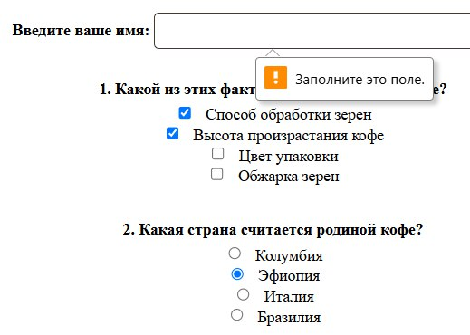
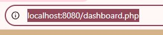
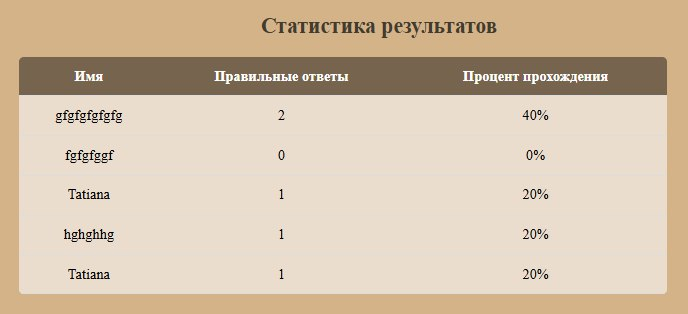

# Альтернативная аттестационная работа 01. Разработка веб-приложения для создания и прохождения тестов
## Цель
Создать веб-приложение для прохождения теста с возможностью просмотра результатов. Приложение должно предоставлять пользователям интерфейс для прохождения теста.
## Тема проекта: тест о кофе
Этот проект — веб-приложение для прохождения теста о кофе. Тест включает несколько вопросов с возможностью выбора одного или нескольких ответов. После завершения теста пользователь видит свой результат, который сохраняется в отдельном файле и отображается в таблице на странице с результатами.
## Структура проекта
Проект содержит следующие файлы, кторые видит пользователь:
* index.php - главная страница с кнопкой начала теста
* test.php - страница с самим тестом
* result.php - страница на которой отображается результат теста
* dashboard.php - страница с таблицей результатов<br>

И файлы, которые обеспечивают внутреннюю работу всего:
* process_test.php - отвечает за обработку теста
* data.json - файл, который хранит все вопросы теста и ответы пользователей
* style.css - файл для стилизации формы
## Инструкция по запуску проекта
* Скачайте все файлы проекта в директорию веб-сервера.
* Убедитесь, что в файле testData.json есть вопросы и ответы для теста.
* Запустите веб-сервер.
* Перейдите в браузер по адресу http://localhost/index.php.
* Пройдите тест и отправьте результаты.
* Результаты будут сохранены в testData.json и отображены на странице result.php.
* Перейдите на страницу dashboard.php, чтобы увидеть результаты тестов.
## Структура файла json
В файле testData.json храню такие данные, как вопросы тестов(с ответами) и результаты прохождения теста пользователями. Он имеет принцип массива с объектами с определенными ключами и выглядит это так для вопросов:
```json
    "questions": [
        {
            "question": "\u041a\u0430\u043a\u043e\u0439 \u0438\u0437 \u044d\u0442\u0438\u0445 \u0444\u0430\u043a\u0442\u043e\u0440\u043e\u0432 \u0432\u043b\u0438\u044f\u0435\u0442 \u043d\u0430 \u0432\u043a\u0443\u0441 \u043a\u043e\u0444\u0435?",
            "type": "checkbox",
            "answers": [
                "\u0421\u043f\u043e\u0441\u043e\u0431 \u043e\u0431\u0440\u0430\u0431\u043e\u0442\u043a\u0438 \u0437\u0435\u0440\u0435\u043d",
                "\u0412\u044b\u0441\u043e\u0442\u0430 \u043f\u0440\u043e\u0438\u0437\u0440\u0430\u0441\u0442\u0430\u043d\u0438\u044f \u043a\u043e\u0444\u0435",
                "\u0426\u0432\u0435\u0442 \u0443\u043f\u0430\u043a\u043e\u0432\u043a\u0438",
                "\u041e\u0431\u0436\u0430\u0440\u043a\u0430 \u0437\u0435\u0440\u0435\u043d"
            ],
            "correct": [
                "0",
                "1",
                "3"
            ]
        },
        {
            "question": "\u041a\u0430\u043a\u0430\u044f \u0441\u0442\u0440\u0430\u043d\u0430 \u0441\u0447\u0438\u0442\u0430\u0435\u0442\u0441\u044f \u0440\u043e\u0434\u0438\u043d\u043e\u0439 \u043a\u043e\u0444\u0435?",
            "type": "radio",
            "answers": [
                "\u041a\u043e\u043b\u0443\u043c\u0431\u0438\u044f",
                "\u042d\u0444\u0438\u043e\u043f\u0438\u044f",
                "\u0418\u0442\u0430\u043b\u0438\u044f",
                "\u0411\u0440\u0430\u0437\u0438\u043b\u0438\u044f"
            ],
            "correct": [
                "1"
            ]
        },
        {
            "question": "\u041a\u0430\u043a \u043d\u0430\u0437\u044b\u0432\u0430\u0435\u0442\u0441\u044f \u043c\u0435\u0442\u043e\u0434 \u0437\u0430\u0432\u0430\u0440\u0438\u0432\u0430\u043d\u0438\u044f \u043a\u043e\u0444\u0435, \u043f\u0440\u0438 \u043a\u043e\u0442\u043e\u0440\u043e\u043c \u043d\u0430\u043f\u0438\u0442\u043e\u043a \u0433\u043e\u0442\u043e\u0432\u0438\u0442\u0441\u044f \u043f\u043e\u0434 \u0434\u0430\u0432\u043b\u0435\u043d\u0438\u0435\u043c \u043f\u0430\u0440\u0430?",
            "type": "radio",
            "answers": [
                "\u041a\u0435\u043c\u0435\u043a\u0441",
                "\u0424\u0440\u0435\u043d\u0447-\u043f\u0440\u0435\u0441\u0441",
                "\u042d\u0441\u043f\u0440\u0435\u0441\u0441\u043e",
                "\u041a\u043e\u043b\u0434-\u0431\u0440\u044e"
            ],
            "correct": [
                "2"
            ]
        },
        {
            "question": "\u041a\u0430\u043a\u0438\u0435 \u0441\u043f\u043e\u0441\u043e\u0431\u044b \u0437\u0430\u0432\u0430\u0440\u0438\u0432\u0430\u043d\u0438\u044f \u043a\u043e\u0444\u0435 \u043e\u0442\u043d\u043e\u0441\u044f\u0442\u0441\u044f \u043a \u0444\u0438\u043b\u044c\u0442\u0440-\u043c\u0435\u0442\u043e\u0434\u0430\u043c?",
            "type": "checkbox",
            "answers": [
                "\u041f\u0443\u0440\u043e\u0432\u0435\u0440",
                "\u041a\u0435\u043c\u0435\u043a\u0441",
                "\u0422\u0443\u0440\u043a\u0430",
                "\u0410\u044d\u0440\u043e\u043f\u0440\u0435\u0441\u0441"
            ],
            "correct": [
                "0",
                "1"
            ]
        },
        {
            "question": "\u041a\u0430\u043a \u043d\u0430\u0437\u044b\u0432\u0430\u0435\u0442\u0441\u044f \u0432\u0435\u0449\u0435\u0441\u0442\u0432\u043e \u0432 \u043a\u043e\u0444\u0435, \u043a\u043e\u0442\u043e\u0440\u043e\u0435 \u043e\u0442\u0432\u0435\u0447\u0430\u0435\u0442 \u0437\u0430 \u0431\u043e\u0434\u0440\u044f\u0449\u0438\u0439 \u044d\u0444\u0444\u0435\u043a\u0442?",
            "type": "radio",
            "answers": [
                "\u0422\u0435\u043e\u0431\u0440\u043e\u043c\u0438\u043d",
                "\u041a\u043e\u0444\u0435\u0438\u043d",
                "\u0422\u0430\u043d\u0438\u043d",
                "\u0413\u043b\u0443\u0442\u0430\u043c\u0430\u0442"
            ],
            "correct": [
                "0"
            ]
        }
    ],
```
И так для результатов пользователей:
```json
"results": [
        {
            "username": "gfgfgfgfgfg",
            "correct": 2,
            "score": 40
        },
        {
            "username": "fgfgfggf",
            "correct": 0,
            "score": 0
        },
        {
            "username": "Tatiana",
            "correct": 1,
            "score": 20
        },
        {
            "username": "hghghhg",
            "correct": 1,
            "score": 20
        }
    ]
```
## Краткое опиание функционала приложения
Код сопровождается соответствующей документацие, поэтому зднсь подчеркну основные задачи всех файлов
### index.php
Начальная страница моего приложения. Содержит кнопку, при нажатии на которую, пользователь переходит к самому тесту.
```html
<!DOCTYPE html>
<html lang="ru">
<head>
    <meta charset="UTF-8">
    <meta name="viewport" content="width=device-width, initial-scale=1.0">
    <title>Тест по кофе</title>
    <link rel="stylesheet" href="styles/style.css"> 
</head>
<body>
    <div class="container">
        <h2>Добро пожаловать в тест по кофе!</h2>
        <p>Проверьте свои знания о кофе</p>
        <a href="test.php"><button class="start-button">Пройти тест</button></a>
    </div>
</body>
</html>
```
### test.php
Страница с формой где происходят основнфе действия. СЮда подключен файл для обработки почтупивших ответов, а также происходит вывод самого теста. В документации будее подробно описаны отдельные части кода.
```php
<?php
/**
 * Подключаем файл для обработки теста.
 * В этом файле содержится логика обработки ответов пользователя и вычисления результатов.
 */
require_once 'testAnalyze.php'; // Подключаем логику из process_test.php
?>

<!DOCTYPE html>
<html lang="ru">
<head>
    <meta charset="UTF-8">
    <meta name="viewport" content="width=device-width, initial-scale=1.0">
    <title>Тест по кофе</title>
    <link rel="stylesheet" href="styles/style.css">
</head>
<body>
    <h2>Проверь свои знания о кофе:</h2>
    <form action="test.php" method="POST">
        <label>Введите ваше имя:</label>
        <input type="text" name="username" required>

        <?php 
        /**
         * Проходим по всем вопросам, загруженным из JSON
         * Все вопросы содержать такие данные как текст вопроса, варианты ответа. Эти данные отображаются вользователю в форме
         */
        foreach ($questions as $index => $q): 
            if (empty($q["question"]) || empty($q["answers"])) continue;
        ?>
            <p><?php echo ($index + 1) . ". " .htmlspecialchars($q["question"]); ?></p>
            
            <?php 
            /**
             * Перебираем все ответы для текущего вопроса.
             * В зависимости от его типа (radio или checkbox) создаем соответствующие HTML-элементы
             */
            foreach ($q["answers"] as $key => $answer): 
                $inputType = htmlspecialchars($q["type"]);  // Тип элемента (radio или checkbox)
                $inputName = "answer[$index]"; // Имя для передачи данных в POST

                /**
                 * Если ответ типа checkbox, то добавляем [] в имя,
                 * чтобы можно было передавать массив нескольких значений, которые были выбраны.
                 */
                if ($inputType == 'checkbox') {
                    $inputName .= '[]';
                }
            ?>
                <!-- Генерируем поле ввода для ответа -->
                <input type="<?= $inputType ?>" name="<?= $inputName ?>" value="<?= $key ?>"> 
                <?=htmlspecialchars($answer) ?><br>
            <?php endforeach; ?>
            <br>
        <?php endforeach; ?>
        <button type="submit">Отправить</button>
</form>
</body>
</html>
```
### testAnalyze.php
Этот код отвечает за обработку теста. Он загружает вопросы и данные из файла testData.json. Збрабатывает ответы пользователя, подсчитывает правильные ответы и вычисляет процент. Записывает результаты в тот же JSON-файл. Перенаправляет пользователя на страницу с результатами.
```php
<?php
/**
 * Обрабатывает тест, загружает вопросы из файла и вычисляет результаты.
 * 
 * Файл `data.json` используется для хранения данных о вопросах и результатах тестов.
 * После прохождения теста результаты сохраняются в этом файле.
 * 
 * Обрабатываются данные формы, подсчитываются правильные ответы и вычисляется процент правильных ответов.
 * Затем результаты записываются в файл и происходит перенаправление на страницу с результатами.
 */

$dataFile = "testData.json";

/**
 * Проверяет наличие файла с данными.
 * 
 * Если файл `testData.json` отсутствует, выводится сообщение об ошибке и выполнение скрипта прекращается,
 * чтобы избежать попытки работы с несуществующими данными.
 */
if (!file_exists($dataFile)) {
    echo "Файл данных не найден.";
    exit;
}

/**
 * Загружает и декодирует данные из JSON-файла.
 * 
 * Считывает содержимое файла `data.json` и преобразует его в ассоциативный массив.
 * Если ключ "questions" отсутствует, используется пустой массив по умолчанию.
 */
$data = json_decode(file_get_contents($dataFile), true);
$questions = $data["questions"] ?? [];

/**
 * Проверяет наличие вопросов в загруженных данных.
 * 
 * Если массив вопросов пуст, выводится сообщение об ошибке и выполнение скрипта прекращается,
 * так как тест без вопросов невозможен.
 */
if (empty($questions)) {
    echo "Нет вопросов для теста.";
    exit;
}

/**
 * Обработка POST-запроса.
 * 
 * Если запрос отправлен методом POST, выполняется подсчет правильных ответов.
 */
if ($_SERVER["REQUEST_METHOD"] === "POST") {
    $username = $_POST["username"];

    /**
     * Получает ответы пользователя
     * 
     * Если ответов нет, то по умолчанию используется пустой массив.
     */
    $userAnswers = $_POST["answer"] ?? [];

    $correctCount = 0;
    $totalQuestions = count($questions);

    /**
     * Проходит по всем вопросам и сравниваем ответы пользователя с правильными.
     */
    if (empty($errors)) {
    foreach ($questions as $index => $q) {
        $correct = $q["correct"];
        $userResponse = $userAnswers[$index] ?? [];

        /**
         * Если вопрос типа checkbox, то ответы пользователя и правильные ответы сортируются
         * для точного сравнения.
         */
        if ($q["type"] === "checkbox") {
            sort($userResponse);
            sort($correct);
            if ($userResponse === $correct) {
                $correctCount++;
            }
        } else {
            if ($correct[0] == $userResponse) {
                $correctCount++;
            }
        }
    }

    /**
     * Вычисляет процент правильных ответов.
     * 
     * Процент правильных ответов рассчитывается как отношение количества правильных ответов
     * к общему числу вопросов, умноженное на 100. Результат округляется до двух знаков после запятой.
     */
    $score = round(($correctCount / $totalQuestions) * 100, 2);

    /**
     * Добавляет результаты теста в массив данных.
     * 
     * Результаты включают имя пользователя, количество правильных ответов и процент правильных ответов.
     * Эти данные добавляются в массив `results`, который хранит все результаты тестов.
     */
    $data["results"][] = [
        "username" => $username,
        "correct" => $correctCount,
        "score" => $score
    ];

    /**
     * Записывает обновленные данные в файл.
     * 
     * Массив данных, включая результаты теста, преобразуется в формат JSON с отступами для улучшенной читаемости.
     * Полученная строка записывается в файл `testData.json`, перезаписывая его содержимое.
     */
    file_put_contents($dataFile, json_encode($data, JSON_PRETTY_PRINT));

    /**
     * Перенаправляет пользователя на страницу с результатами теста.
     * 
     * После завершения обработки теста, скрипт перенаправляет пользователя на страницу `result.php`,
     * передавая количество правильных ответов и процент правильных ответов в URL-параметрах.
     * После этого выполнение скрипта прекращается.
     */
    header("Location: result.php?correct=$correctCount&score=$score");
    exit;
}
}
```
### result.php
Этот код отвечает за отображение результатов теста. Он принимает данные из URL (GET-параметры), обрабатывает их и выводит на веб-страницу. Разберем его подробно строка за строкой.
```php
<?php
/**
 * Извлекает параметры с результатами из URL.
 * 
 * Получает количество правильных ответов и процент правильных ответов из GET-параметров.
 * Если параметры не указаны, используется значение по умолчанию:
 * 
 * @var int $correctCount Количество правильных ответов.
 * @var float $score Процент правильных ответов.
 */
$correctCount = isset($_GET["correct"]) ? (int)$_GET["correct"] : 0;
$score = isset($_GET["score"]) ? (float)$_GET["score"] : 0;
?>

<!DOCTYPE html>
<html lang="ru">
<head>
    <meta charset="UTF-8">
    <meta name="viewport" content="width=device-width, initial-scale=1.0">
    <title>Тест по кофе</title>
    <link rel="stylesheet" href="styles/style.css">
</head>
<body>
    <div class="result-box">
        <h2>Ваш результат</h2>
        <p class="result-text">Количество правильных ответов: <b><?= $correctCount ?></b></p>
        <p class="result-text">Процент сдачи теста: <b><?= $score ?>%</b></p>
        <a href="test.php" class="button">Пройти тест заново</a>
    </div>
</body>
</html>
```
### dashboard.php
Этот код загружает результаты тестов из файла testData.json и отображает их в виде таблицы на веб-странице. Он сначала проверяет наличие файла и корректность JSON-данных, а затем извлекает сохраненные результаты, включая имя пользователя, количество правильных ответов и процент прохождения теста. После этого формируется HTML-страница, на которой данные представлены в виде таблицы. 
```php
<?php
/**
 * Файл для вывода таблицы со статистикой по тестам
 * 
 * Считывает данные о результатах тестов из файла data.json и отображает их в виде таблицы
 * Загружает содержимое файла, декодирует JSON и выводит результаты тестов
 * Если на этом этапе случается ошибка, тогда выводится соответствующее сообщение.
 * 
 * Выводит таблицу с результатами прохождения пользователями теста
 */

$dataFile = "testData.json";

/**
 * Проверяет существование файла с данными.
 * 
 * Если файл `data.json` отсутствует, выводится сообщение об ошибке и выполнение скрипта прекращается.
 */
if (!file_exists($dataFile)) {
    echo "Файл данных не найден.";
    exit;
}

/**
 * Загружает и декодирует данные из JSON-файла.
 * 
 * Считывает содержимое файла `data.json` и преобразует его в ассоциативный массив.
 * Если при декодировании произошла ошибка, выводится сообщение и выполнение скрипта прекращается.
 */
$data = json_decode(file_get_contents($dataFile), true);
if (json_last_error() !== JSON_ERROR_NONE) {
    echo "Ошибка чтения JSON.";
    exit;
}

/**
 * Получает массив результатов тестов из данных.
 * 
 * Если в загруженном JSON отсутствует ключ "results", используется пустой массив,
 * чтобы избежать ошибок при обработке данных.
 */
$results = isset($data["results"]) ? $data["results"] : []; // Проверка наличия результатов
?>

<!DOCTYPE html>
<html lang="ru">
<head>
    <meta charset="UTF-8">
    <meta name="viewport" content="width=device-width, initial-scale=1.0">
    <title>Тест по кофе</title>
    <link rel="stylesheet" href="styles/style.css">
</head>
<body>
<h2>Статистика результатов</h2>
<table class="table">
    <thead>
        <tr>
            <th>Имя</th>
            <th>Правильные ответы</th>
            <th>Процент прохождения</th>
        </tr>
    </thead>
    <tbody>
        <?php foreach ($results as $result): ?>
            <tr>
                <td><?=htmlspecialchars($result["username"]) ?></td>
                <td><?=htmlspecialchars($result["correct"]) ?></td>
                <td><?=htmlspecialchars($result["score"]) ?>%</td>
            </tr>
        <?php endforeach; ?>
    </tbody>
</table>
</body>
</html>
```
### Примеры тестов + скриншоты работы приложения
1. **Главная страница:** Кнопка для перехода к тесту.<br>

2. **Страница теста:** Форма с вопросами и вариантами ответов.<br>

3. **Ошибка в случае отсутствия имени**<br>

4. **Результаты теста:** Страница, где показывается количество правильных ответов и процент.<br>

5. **Ссылка, чтобы открыть таблицу результатов**<br>

6. **Таблица результатов:** Страница, отображающая список всех пользователей и их результаты.<br>

